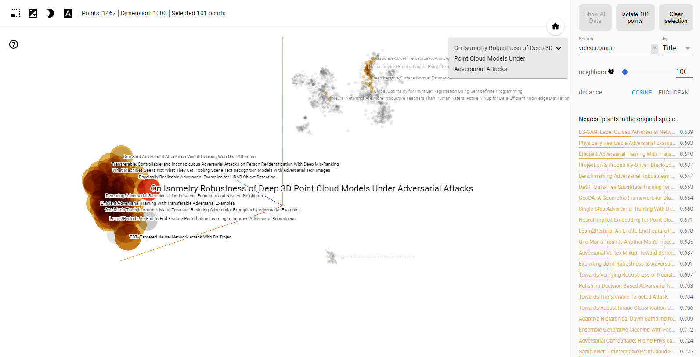

# Visualize CVPR2020 papers
Search by similarity and make sense of ~1500 papers with TF-IDF and t-SNE in Tensorboard.

List of papers: http://openaccess.thecvf.com/CVPR2020.py



## To visualize in Tensoboard
1. Download `X.tsv` and `labels.tsv`.
2. Go to https://projector.tensorflow.org/
3. Click on Load and upload files.
4. Run t-SNE on default settings for ~1000 iterations

## To download papers and train
Create a virtual env if you want to
```bash
pip install sklearn numpy tqdm
python process.py
```

This will download 1467 pdfs, convert pdf to text, train Tfidf, and dump `X_new.tsv`, `labels.tsv`
